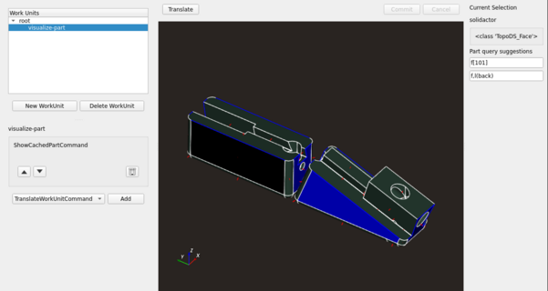

# What is this?



Primarily, this project is a python library that sits on top of pythonocc, which itself is a 
wrapper around OCCT (Open CasCade Technology), which itself is a very large set of tools and 
libraries for BRep ("Boundary Representation") modelling.

BRep modelling is preferable for CAD/CAM applications, where the requirement for explicit 
geometric definitions precludes mesh-based modelling (more common in CGI or artistic applications).
An imprecise analogy would be comparing SVG vector graphics to PNG rasterization.

OCCT is huge and quite powerful. Unfortunately it suffers from the limitations of hit-and-miss 
documentation, older coding conventions, poor feature discoverability, and the occasional comment
block written in French. All of these are easily offset by the fact that it is free and open source.

pythonocc is an admirably transparent wrapper around OCCT, exposing most of it without 
significant changes to the API, and adding a few extras, e.g. the viewer. OCCT entities such as the 
ubiquitous library-specific smart pointer are abstracted away (mostly) without issue.

This library attempts to provide a fluent API for performing tasks that would take hundreds 
of lines of code if written in pythonocc alone. The eventual aim is to have something like OpenSCAD, 
but with constraint based modelling and avoiding the DSL.

There are a few other dependencies that I have not mentioned yet. VTK 
(short for Visualization Tool Kit) is an OOP library based on OpenGL to automate the rendering of data sets 
mostly aimed at STEM applications. The inbuilt viewer classes that come with OCC (there is a VTK one)
were not customizable enough to be useful, so I had to implement my own. This issue has been a common 
theme when working with these tools, and why I choose to build them from source vs. using prebuilt 
packages from, for instance, apt.

Finally there is Solvespace, which hasn't really been integrated
very far but is intended to act as the geometric constraint solver (GCS) for when I get around to adding
constraint based modelling.

# Setup and Installation

## Requirements

- Docker ~= 20.10.22

## Dev setup

### Create an Image

There are quite a few dependencies and they can be quite tricky to get working together, 
so the best way is to create a docker container. See [docker](./docker). You can create the image by:

```commandline
# starting from project root

pushd docker
./docker_build.sh
```

The `Dockerfile` serves as documentation for how setup can be performed manually. Note that due 
to the specific versions required, the dependencies are cloned and built from source. This will
take quite a long time.

### To start the Container:

```commandline
./docker_run.sh
```

On start the container will install the python project as an editable pip package,
so any changes you make under `src` will have immediate effect.
The project directory is mapped to container dir `/wsp`.

To export files, e.g. `step`,`stl` you can use the project directory `output`, 
which is mapped to the container directory `/wsp/output`.

Due to the work which needs to be done at startup, you will probably want to
pause the container instead of killing it.

### Running Projects

By convention, executable projects are stored under the `projects` dir, it's simple to
run them:

```commandline
# in container, starting from /wsp
python3 projects/project_name.py
```

Since the library is under development and new features are added when needed, 
older projects are less likely to work. Check the commit history for
the most recent ones to have the best chance of them running correctly.

### Running Tests

To run the meagre set of unit tests:

```commandline
# in container, starting from /wsp
./run_tests.sh
```
